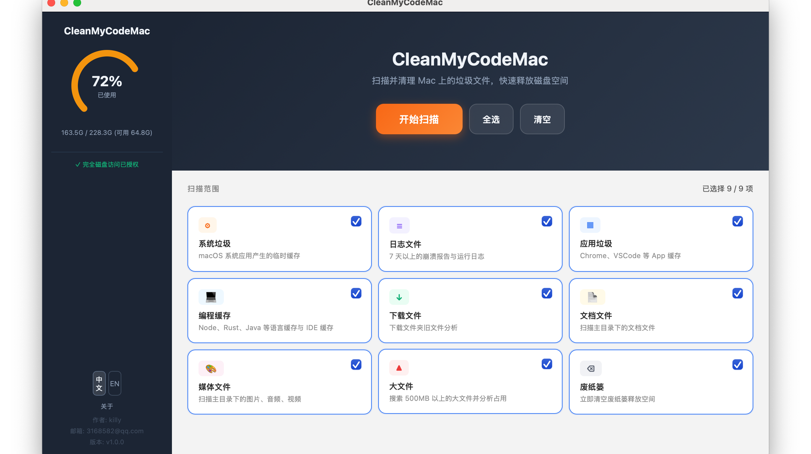

# CleanMyCodeMac

A macOS disk cleanup tool built for developers. 

[中文文档](README_ZH.md)

## Features

- **System Cache** — Clean temporary caches from macOS system apps
- **App Cache** — Clean caches from Chrome, VSCode, JetBrains, Slack, Telegram, and other third-party apps
- **Dev Cache** — Clean caches from Node.js, Python, Ruby, Rust, Go, Java, AI model tools, and other toolchains
- **Documents** — Scan PDF, Word, Excel, Markdown, iWork, and other document files
- **Media** — Scan images, audio, and video files, including media inside Downloads
- **Log Files** — Clean crash reports and runtime logs
- **Downloads** — Analyze files in the Downloads folder, grouped by type
- **Large Files** — Find files larger than 500MB with quick analysis helpers
- **Trash** — Inspect Trash usage and empty it when needed

## Highlights

- Native macOS app built with Swift, AppKit, and WKWebView
- Local-first: scans and cleanup decisions run on your Mac
- Grouped scan results with expand-by-category/app drill-down
- Safety labels (Safe to clean / Use caution)
- Unsafe files move to Trash when possible; safe cleanup targets can be removed directly
- Quick reveal in Finder
- Configurable scan scope

## Screenshots



## Quick Start

### Requirements

- macOS 13.0+
- Xcode 16.4+ or a compatible Swift 6.1 toolchain

### Run

```bash
swift run

# Or double-click run.command
```

### Build as .app / .dmg

```bash
./build_dmg.sh
# Output:
# - dist/<arch>/CleanMyCodeMac.app
# - dist/CleanMyCodeMac-<arch>.dmg
```

See [BUILD.md](BUILD.md) for full build instructions.

## Privacy & Permissions

- All scan and cleanup logic runs locally on your Mac.
- No cloud service is required for normal use.
- Some scan targets may require Full Disk Access to be fully visible.
- Cleanup operations move files to Trash when possible, so items remain recoverable.

## Project Structure

```text
Package.swift
source/
├── AppMain.swift           # AppKit window + WKWebView startup
├── AppSupport.swift        # Bridge bootstrap, disk/permission/lang helpers
├── NativeBridge.swift      # JS bridge entrypoints
└── NativeScanEngine.swift  # Native scan, selection, cleanup, analysis
resources/
├── ui/
│   └── index.html              # Current single-page frontend UI
├── screenshots/
│   └── home-readme.png
├── app_icon.png
└── app.icns
build_dmg.sh                    # Build .app + .dmg via SwiftPM
build_icon.sh                   # Generate app.icns from app_icon.png
sign_and_notarize.sh            # Sign / notarize app and dmg
```

## License

[MIT](LICENSE)

## Contributing

See [CONTRIBUTING.md](CONTRIBUTING.md) for local setup, validation, and pull request guidance.
